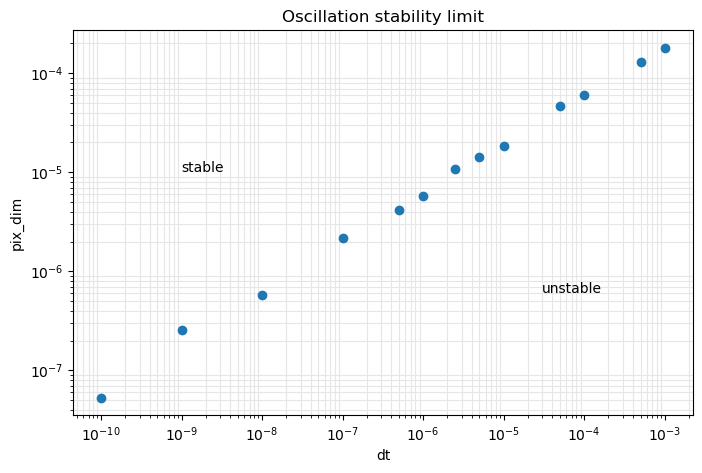

# Sand casting simulation 

## Investingating temperature field instabilities  

$q = k∆T$ 

where:  $q =$ heat flux per unit area, $k =$ thermal conductivity

Temperature is updated using the formula:   
$dT = \large\frac{q \times dt}{shc \times density \times pixdim}$

Fitting a straight line of best fit ($R^2 = 0.9991$) determines that: 

condition for stability is $\frac{pixdim^2}{dt} > 3.297 \times 10^{-5}$

